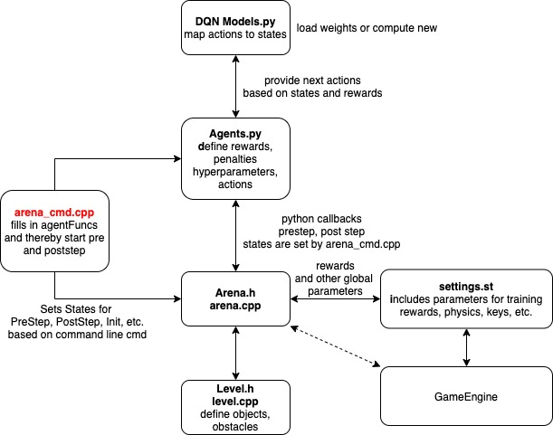

# arena2D
A plattform to ease DRL research.

Arena2D is a research framework for fast development and training of reinforcement learning algorithms for autonomous navigation. 
It aims to ease the overall pipeline and make training more efficient using simple 2D environments together with interfaces for additional modules, 
which users can freely experiment with. We have incorporated novel ideas from state of the art research and arena2d provides APIs, which every user can 
use to integrate new ideas.

Our design principles are:

- Efficient simulation: Training in arena2D require less time compared to 3D simulations while achieving similar results on lidar scan data.
- Flexible development: Make it easy for new users to try out research ideas.
- Easy experimentation: Make it easy for new users to test with benchmarks and run richful evaluations
- Modular expandability: New functionalities can be build in easily, therefore we provide APIs.


<p align="center">
  
	
</p>


## Table of contents
   1. [Motivation](#Updates)
   1. [Citing Arena2D](#citing-arena)
   1. [Installation](#installation)
   1. [Docker Setup](#docker-setup)
   1. [Training and Testing Agent](#example)
   1. [Documentation](#documentation)
   1. [Simulation Environment](#simulation-environment)
   1. [Baselines](#baselines)
   1. [Tutorials](#tutorials)
   1. [License](#license)
   1. [Acknowledgments](#acknowledgments)
   1. [References](#references-and-citation)


## Citing Arena2D
If you use the arena2d platform in your research, please cite the following [paper](https://arxiv.org/abs/2008.00516):

````
@article{kastner2020deep,
  title={Deep-Reinforcement-Learning-Based Semantic Navigation of Mobile Robots in Dynamic Environments},
  author={K{\"a}stner, Linh and Marx, Cornelius and Lambrecht, Jens},
  journal={arXiv preprint arXiv:2008.00516},
  year={2020}
}
````

## Updates
* 15/08/2020:** including a new class to simulate 2d humans
* 29/07/2020:** including integration into ROS melodic see branch arena-ros
* 01/07/2020:** including A3C agent, based on [Lapan et al. (2018)][lapan]
* 01/06/2020:** including asynchronous training. It is now possible to run multiple training environments and threads in parallel. See agent-sim.rd section asynchronous training for more information


# Instructions
The simulator is built using CMake. Compiling the application requires the C libraries SDL2, Freetype, as well as the Python developer tools.
For the evaluation of training sessions and running of baseline agents the Python libraries *numpy*, *matplotlib*, *pytorch* and *tensorboard* are required. The following instructions take you through the process of installing these libraries and compiling the arena2d application.

NOTE: We built using CMake 3.14. For CMake Version above 3.14. you might encounter the error message 
```
CMake Error at CMakeLists.txt:18 (add_executable):
  Target "main" links to item "-L/usr/lib/x86_64-linux-gnu -lSDL2 " which has
  leading or trailing whitespace.  This is now an error according to policy
  CMP0004.
```
In that case open sdl2-config.cmake in 


```
sudo vim /usr/lib/x86_64-linux-gnu/cmake/SDL2/sdl2-config.cmake
```
and remove the space in the last line 
```
set(SDL2_LIBRARIES "-L${SDL2_LIBDIR}  -lSDL2 ")   <---- here
```

## Installation
It is encouraged (but not necessary) to install the python libraries within a conda environment:
```
conda create --name arena2d
conda activate arena2d
```
Now you can safely install the python libraries without the risk of breaking any dependencies:
Inside the conda environment you can install the libraries using conda or pip. 
### Conda: 

```
conda install -c anaconda cmake 
conda install -c conda-forge matplotlib 
conda install -c pytorch torchvision 
```
Make sure your PYTHONPATH is pointing to these libs e.g. you can set it inside the commandline:

```
export PYTHONPATH=$HOME/anaconda3/envs/arena2d/lib/python3.8/site-packages
```

### Pip:
```
pip install cmake python-devtools numpy matplotlib torch torchvision tensorboard
```
Install libraries for compiling:
### Ubuntu 
```
sudo apt-get install cmake libsdl2-dev libfreetype-dev
```

### Mac OS X
```
brew install cmake sdl2 freetype
```

## Building
Clone the repository and navigate to the folder `arena2d-sim/`:
```
git clone https://github.com/ignc-research/arena2d
cd arena2d/arena2d-sim/
```

Create build directory:
```
mkdir build && cd build/
```

Configure CMake and build application:
```
cmake ../ -DCMAKE_BUILD_TYPE=Release
make -j
```
**Error Handling**: In case you run into errors complaining about missing libs and dependencies do following changes inside 
CMakeList.txt:
1. delete box2d from 

```
set(ARENA_LINK_LIBRARIES	
	box2d
	${OPENGL_gl_LIBRARY}
	${SDL2_LIBRARIES}
	${FREETYPE_LIBRARIES}
	${PYTHON_LIBRARIES}
	
)
```
2. Add box2d, pthread, util and ${CMAKE_DL_LIBS} to target_link_libraries (line 106) (in the same order as below!)
```
target_link_libraries(${PROJECT_NAME}  "${CMAKE_DL_LIBS} ${ARENA_LINK_LIBRARIES}" pthread ${CMAKE_DL_LIBS} box2d util)
```

3. Save and make again
```
make -j
```

After compilation with Cmake make sure that python from your conda environment is used instead of your system conda. The output of 
```
cmake ../ 
```
should look as following (when using conda and python 3.8)


```
Variable
-- Using python version 3.8.5
Include directories:
  -> sdl2:     /usr/include/SDL2
  -> freetype: /usr/include/freetype2/usr/include/x86_64-linux-gnu/freetype2
  -> python:   /home/username/anaconda3/envs/py3.8/include/python3.8

Libraries:
  -> sdl2:     -L/usr/lib/x86_64-linux-gnu  -lSDL2
  -> opengl:   /usr/lib/x86_64-linux-gnu/libGL.so
  -> freetype: /usr/lib/x86_64-linux-gnu/libfreetype.so
  -> python:   /home/username/anaconda3/envs/py3.8/lib/libpython3.8.so
  ```
  


(*Optional*) Install binary to system folder:
```
sudo make install
```

## Running
Once you have compiled the application you can run the application from the `arena2d-sim/` folder with `./build/arena2d`.
If you have installed the binary to your system folder you can run the simulator from anywhere by simply executing `arena2d`.

## Docker Setup
TBR

## Training and Testing Agents
For training and testing preexisting or new agents please see [Agent-Doc](./arena2d-agents/README.md)

## Documentation
Overall workflow of arena2D. The simulator is written in C++ whereas the agent files including network designs and DRL algorithms are reralized in python. The simulator will call the respective python function using callbacks.

<p align="center">
  
  <p align="center"><i>Architecture of arena2d</i></p>
</p>

## Simulation Environment
See [Simulation-Doc](./arena2d-sim/README.md) for more details about the sensor data, how you can add new classes, levels, etc. 

## Baselines

We provide some pretrained agents as baselines, which can be downloaded using following link: TBR.
We compare the agents in terms of the different metrics: Success Rate, Collision Rate (number of collisions), efficiency (time to reach goal), training time on a GPU RTX 2080 TI, 8 Cores CPU. Note: test runs were conducted a total of 30 times and the average was calculated. More details will be released soon.

  | Agents | Success Rate [%] | Collision Rate [%]|Training Time| Complex Environment |
  |:-------:|:-------------:|:---------:|:-----:|:-----:|
  | vanilla DQN | 99.9           | 0.1         |   18h  | no     |
  | DQN 1/2-step| 99.9           | 0.1         |   12h  | no     |
  | Double DQN 1/2-Step| 99.9           |0     |   8h      | no    |
  | D3QN| x           |x     |   ×      | ×    |
  | DQN + LSTM | not stable! 62           |30     |   3d      | yes    |
  | A3C + LSTM (discrete)| not stable! 44          |14     |   4d 5h      | yes    |
| A3C + LSTM (continous)| x           |x     |   ×      | ×    |
| PPO + LSTM| x           |x     |   ×      | ×    |
| DDPG + LSTM| x           |x    |   ×      | ×    |


## Tutorials
We provide some basic tutorials, on how to setup a basic training workflow including agent setup, parameter settings and evaluation pipeline. 
TBR

## License
Arena2D is MIT licensed. See the [LICENSE file](/LICENSE) for details.


[lapan]: https://books.google.de/books?hl=en&lr=&id=xKdhDwAAQBAJ&oi=fnd&pg=PP1&dq=lapan+reinforcement+learning&ots=wTgggiYhaD&sig=VjRRQF20if5gCTVjFiuLkw_5mbk#v=onepage&q=lapan%20reinforcement%20learning&f=false
